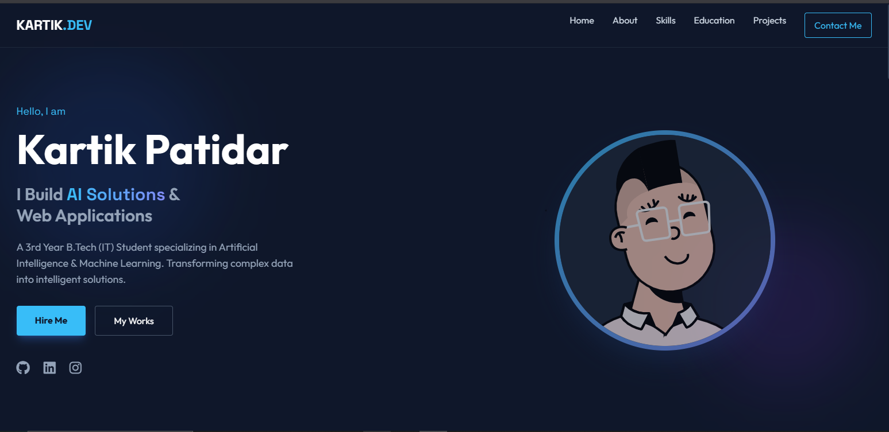

# 👨‍💻 Kartik Patidar | Personal Portfolio Website

A modern, responsive, and dark-themed personal portfolio website built to showcase my journey as an AI/ML Developer and IT student. This project utilizes Tailwind CSS (via CDN) for styling and vanilla JavaScript for interactivity.

---

## 📸 Preview

---

## 🚀 Features

* **⚡ Modern Dark Theme:** Designed with a `slate-900` background and neon accents (Sky Blue & Indigo) for a developer-centric aesthetic.
* **📱 Fully Responsive:** Mobile-first design with a collapsible hamburger menu for smaller screens.
* **🎨 Tailwind CSS:** Utilizes Tailwind's utility classes via CDN for rapid and consistent styling.
* **✨ Animations:**
    * Background floating "Blobs" in the Hero section.
    * Fade-in on scroll effects (Intersection Observer).
    * Smooth scrolling navigation.
* **📂 Dynamic Sections:**
    * **Hero:** Introduction and social links.
    * **About:** Academic summary and bio.
    * **Skills:** Visual progress bars for technical proficiency.
    * **Education:** Vertical timeline layout.
    * **Projects:** Interactive cards with hover effects.
    * **Contact:** Clean layout with social integration.

---

## 🛠️ Tech Stack

* **Frontend Structure:** HTML5
* **Styling:** [Tailwind CSS](https://tailwindcss.com/) (CDN Version) + Custom CSS (`style.css`)
* **Interactivity:** Vanilla JavaScript (`script.js`)
* **Icons:** [FontAwesome 6](https://fontawesome.com/)
* **Fonts:** Google Fonts ('Outfit' and 'Space Grotesk')

---

## 📂 Folder Structure 

/portfolio-kartik
│
├── index.html      # Main HTML structure
├── style.css       # Custom animations, scrollbars, and overrides
├── script.js       # Logic for mobile menu, scroll animations, navbar
└── README.md       # Project documentation

## ⚙️ How to Run Locally
Since this project uses the Tailwind CSS CDN, you do not need to install npm or node_modules.
 * Clone the repository:
   git clone [repo link](repo link)

 * Navigate to the folder:
   cd Portfolio-Website

 * Open index.html:
   * Simply double-click index.html to open it in your browser.
   * Note: Ensure you have an active internet connection so the Tailwind script and Fonts can load.
🎨 Customization Guide
If you want to use this template for yourself, here is what you need to change:
 * Personal Info:
   * Open index.html and search for "Kartik Patidar" to replace with your name.
   * Update the mailto: links in the Contact section.
 * Images:
   * Replace the Avatar URL in the Hero section:
     

 * Colors:
   * The colors are defined in the tailwind.config script inside the <head> of index.html. You can modify the brand colors there:
     colors: {
    brand: {
        dark: '#0f172a',    // Change Background
        accent: '#38bdf8',  // Change Primary Color
    }
}

## 📬 Contact
Kartik Patidar
 * Email: patidarkartik2818@gmail.com
 * LinkedIn: https://www.linkedin.com/in/kartikpatidar0?utm_source=share&utm_campaign=share_via&utm_content=profile&utm_medium=android_app
 * GitHub: https://github.com/kartik-patidar-18
 * Instagram: 

Made with ❤️ and ☕ by Kartik Patidar

